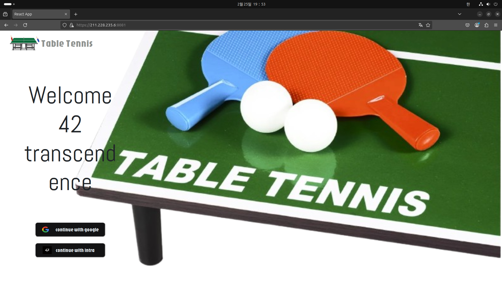

# 42_Transcendence 🗓️ (24.12 - 25.02)

팀원

* CHyuni (Django 백엔드 개발, Django REST Framework를 사용한 API 개발, React 기반 프론트엔드 연동 및 Websocket을 이용한 실시간 통신 기능 구현)
* 1107c (Django 백엔드 개발, ELK 스택 기반 로그 분석 시스템 구축 및 모니터링 환경 구축, Websocket을 이용한 실시간 통신 기능 구현)
* joejaeyoung (Solidity 기반 스마트 컨트랙트 개발 및 배포)
* skyshr (React 기반 사용자 인터페이스 개발 및 유지보수)

## 프로젝트 내용
Django 기반 웹 Ping Pong 게임 사이트 개발

* Docker로 환경 독립적인 배포 구현
* REST API 설계 및 개발
* WebSocket으로 실시간 유저상호작용 구현

로그인 시 홈 화면 로그인은 42 일원들에게 할당 된 42 ID를 이용한 Oauth2.0 을 이용 (google 로그인 부분은 테스트를 위해 oauth 사용을 하지않고 DATABASE에 저장된 ID를 이용해 접근가능)