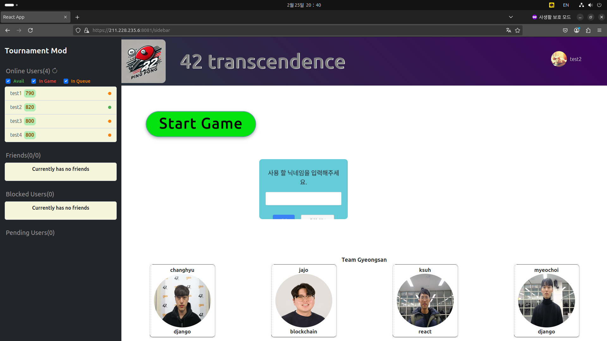

# 42_Transcendence 🗓️ (24.12 - 25.02)

팀원

* CHyuni (Django 백엔드 개발, Django REST Framework를 사용한 API 개발, React 기반 프론트엔드 연동 및 Websocket을 이용한 실시간 통신 기능 구현)
* 1107c (Django 백엔드 개발, ELK 스택 기반 로그 분석 시스템 구축 및 모니터링 환경 구축, Websocket을 이용한 실시간 통신 기능 구현)
* joejaeyoung (Solidity 기반 스마트 컨트랙트 개발 및 배포)
* skyshr (React 기반 사용자 인터페이스 개발 및 유지보수)

## 프로젝트 내용
Django 기반 웹 Ping Pong 게임 사이트 개발

* Docker로 환경 독립적인 배포 구현
* REST API 설계 및 개발
* WebSocket으로 실시간 유저상호작용 구현

<ul>
    <li>로그인: 42 ID를 이용한 OAuth 2.0 인증 (42 일원 전용). Google 로그인은 테스트용이며, DB 내 ID로 접근.</li>
    <li>인증: 로그인 필수 사용자 프로필 API 제공.
        <ul>
            <li>미인증 시: 401 Unauthorized 반환.</li>
            <li>인증 시: 200 OK 및 사용자 프로필 반환.</li>
        </ul>
    </li>
    <li>로그인 상태 관리: 반환된 프로필 정보를 활용. 미로그인 시 홈 화면에 로그인 페이지 표시.</li>
</ul>

<ul>
    <li>로그인 완료시의 화면.
        <ul>
            <li>로그인 완료 시 서버의 전체 소켓에 연결.</li>
            <li>서버소켓으로 실시간 유저 현황 및 상태 관리.</li>
        </ul>
    </li>
</ul>

<ul>
    <li>상대방 프로필 화면.
        <ul>
            <li>선택한 유저의 레이팅, 승패 및 상태 등을 확인할 수 있는 프로필 화면.</li>
            <li>해당 프로필 화면에서 커스텀 게임 요청 및 친구 추가, 블록, 채팅과 같은 상호작용 가능</li>
            <li>상대방과의 상호작용은 서버 소켓을 통한 실시간성 확립</li>
        </ul>
    </li>
</ul>

<ul>
    <li>친구 추가 요청 시 상대방 유저에게 ToastMessage로 알림 후 Pending Users에 응답요청을 생성
        <ul>
            <li>수락 시 해당 유저가 Friends 에 추가</li>
            <li>거절 시 상대방 및 해당 유저 Pending Users 목록에서 요청 제거(따로 알림을 주진 않음)</li>
        </ul>
    </li>
</ul>

<ul>
    <li>친구관계인 상대와 실시간 대화 시스템.
        <ul>
            <li>상대방과 친구 관계라면 Profile 화면의 왼쪽 상단 이미지 클릭의 드롭다운 메뉴를 통해 Chat 기능 활성</li>
            <li>상대방과 친구 관계가 아니라면 Chat이 아닌 친구추가 메뉴 활성</li>
        </ul>
    </li>
</ul>

<ul>
    <li>홈 화면의 Start Game 버튼 클릭 시 게임 진행을 위한 매칭 시스템
        <ul>
            <li>현재 레이팅을 참조해서 매칭이 이루어지진 않고 DataBase를 이용 해 매칭 상태를 업데이트, 매칭 테이블에 먼저 들어온 유저 순서로 매칭 완료.</li>
        </ul>
    </li>
</ul>

<ul>
    <li>매칭이 완료 되면 ToastMessage를 이용해 매칭 완료 알림 후 게임 시작</li>
</ul>

<ul>
    <li>UI가 완성형 이지 않은 상태. 왼쪽 상단 현재 날짜 및 시간, 상대방과 나의 Username을 이용 한 WebSocket 주소 생성 후 게임 진행 유저들 접속
        <ul>
            <li>클라이언트의 입력 게임 결과 등을 서버사이드에서 관리.</li>
            <li>모든 입력 및 결과를 서버에서 관리함으로 인해 Client에서 변조를 방지</li>
        </ul>
    </li>
</ul>

<ul>
    <li>상단 우측 Profile image 클릭 시 나타나는 드롭다운 메뉴의 Stat 클릭 시 이전 게임의 결과 확인가능</li>
</ul>

<ul>
    <li>Tournament Mod 게임 스타트 클릭 시 (좌측 상단의 Casual Mod, Tournament Mod 클릭 시 모드 변경 토글 형식)
        <ul>
            <li>해당 토너먼트에서 사용 할 닉네임 입력 가능.</li>
            <li>빈 칸 입력 시 기본 Username 사용.</li>
            <li>해당 닉네임은 해당 게임에서만 표기될뿐 Stat 등 기록에 관해서는 해당 유저의 본 ID가 나타남.</li>
        </ul>
    </li>
</ul>

<ul>
    <li>토너먼트 시작 시 ToastMessage를 이용 해 게임 시작을 알리고 대진표를 나타냄</li>
</ul>

<ul>
    <li>1라운드 승리 시 기존 Winner 대진표 란에 승자가 표시 되고 승자간 게임 대결 시작
        <ul>
            <li>패배한 유저는 Home으로 돌아가게 되고 승자 대결 종료 후 모든 유저 Home으로 복귀</ul>
        </ul>
    </li>
</ul>