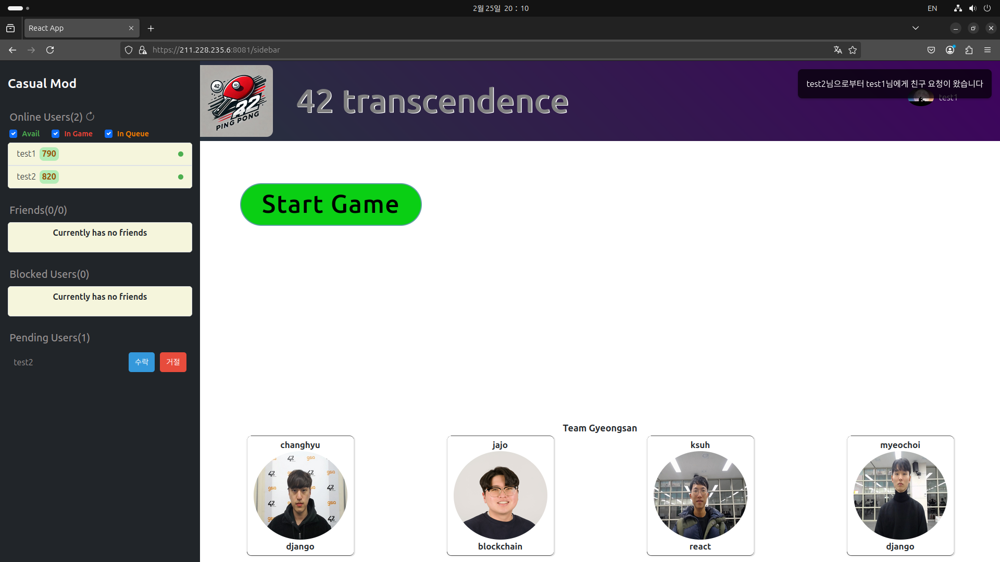
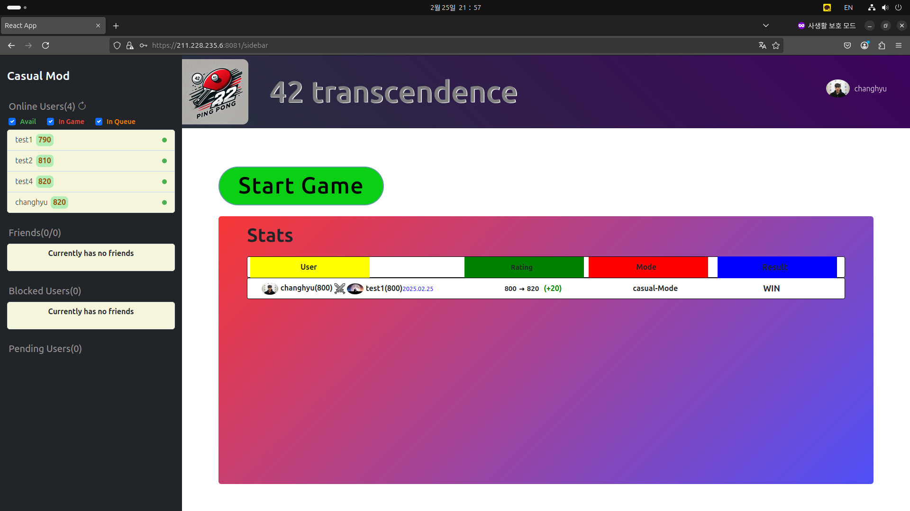

# 42_Transcendence 🗓️ (24.12 - 25.02)

## 프로젝트 개요

이 프로젝트는 Django, REST API, WebSocket을 활용하여 실시간 웹 Ping Pong 게임 사이트를 개발하는 것을 목표로 했습니다. 42 서울 학생들을 대상으로 하며, 간단하고 재미있는 실시간 온라인 탁구 게임 경험을 제공하는 데 집중했습니다.

팀원

* CHyuni (Django 백엔드 개발, Django REST Framework를 사용한 API 개발, React 기반 프론트엔드 연동 및 Websocket을 이용한 실시간 통신 기능 구현)
* 1107c (Django 백엔드 개발, ELK 스택 기반 로그 분석 시스템 구축 및 모니터링 환경 구축, Websocket을 이용한 실시간 통신 기능 구현)
* joejaeyoung (Solidity 기반 스마트 컨트랙트 개발 및 배포)
* skyshr (React 기반 사용자 인터페이스 개발 및 유지보수)

## 기술 스택

* Django: 백엔드 프레임워크로 사용하여 웹 애플리케이션의 구조를 설계하고, 데이터베이스 모델을 정의하고, REST API를 개발했습니다. Django의 ORM을 사용하여 데이터베이스와 효율적으로 상호작용했습니다.
* Django REST Framework: REST API를 효율적으로 설계하고 개발하기 위해 사용했습니다. Serializer를 사용하여 데이터 모델을 JSON으로 변환하고 사용하였습니다.
* React: 사용자 인터페이스를 개발하기 위해 사용했습니다. 컴포넌트 기반 아키텍처를 사용하여 UI를 모듈화하고, 상태 관리를 효율적으로 처리했습니다.
* WebSocket: 실시간 사용자 상호작용을 구현하기 위해 사용했습니다. 채널 레이어를 사용하여 WebSocket 연결을 관리하고, 메시지를 효율적으로 송수신했습니다.
* Docker: 개발 환경과 배포 환경을 일치시키고, 환경 의존성 문제를 해결하기 위해 사용했습니다. Dockerfile을 사용하여 애플리케이션 이미지를 빌드하고, Docker Compose를 사용하여 컨테이너를 관리했습니다.

## 프로젝트 내용
Django 기반 웹 Ping Pong 게임 사이트 개발

* Docker로 환경 독립적인 배포 구현
* REST API 설계 및 개발
* WebSocket으로 실시간 유저상호작용 구현

### 로그인

로그인은 42 ID를 이용한 OAuth 2.0 인증을 통해 이루어집니다 (42 일원 전용). Google 로그인은 테스트용이며, DB 내 ID로 접근합니다.

*   **인증:** 로그인 필수 사용자 프로필 API를 제공합니다.
    *   미인증 시: 401 Unauthorized 반환
    *   인증 시: 200 OK 및 사용자 프로필 반환
*   **로그인 상태 관리:** 반환된 프로필 정보를 활용합니다. 미로그인 시 홈 화면에 로그인 페이지를 표시합니다.

홈 화면은 사용자가 게임을 시작하고, 친구 목록을 확인하고, 프로필을 관리할 수 있는 중앙 허브 역할을 합니다. 모든 상호작용은 ServerSocket을 통해서 이루어져 실시간성을 보장합니다.

선택한 유저의 레이팅, 승패, 온라인 상태 등을 확인할 수 있는 프로필 화면입니다. 이 화면에서 다음과 같은 상호작용이 가능합니다.
<ul>
    <li>커스텀 게임 요청: 상대방에게 직접 게임을 요청할 수 있습니다.</li>
    <li>친구 추가: 상대방을 친구로 추가하여 실시간 대화 및 게임 초대를 할 수 있습니다.</li>
    <li>차단: 원치 않는 상대방을 차단하여 상호작용을 제한할 수 있습니다.</li>
    <li>채팅: 친구로 추가된 상대방과 실시간으로 대화할 수 있습니다.</li>
</ul>
이러한 상호작용은 모두 서버 소켓을 통해 실시간으로 이루어지며, 사용자 경험을 향상시킵니다.

친구 추가 요청 시, 상대방 유저에게 ToastMessage 알림이 전송되고, Pending Users 목록에 요청이 생성됩니다.
<ul>
    <li>수락: 상대방이 요청을 수락하면, 해당 유저가 Friends 목록에 추가됩니다.</li>
    <li>거절: 상대방이 요청을 거절하면, 요청이 상대방 및 해당 유저의 Pending Users 목록에서 제거됩니다. (별도의 알림은 제공되지 않습니다.)</li>
</ul>

친구 관계인 상대와 실시간으로 대화할 수 있는 시스템입니다.
<ul>
    <li>친구 관계: 상대방과 친구 관계인 경우, 프로필 화면의 왼쪽 상단 이미지 클릭 시 드롭다운 메뉴를 통해 Chat 기능을 활성화할 수 있습니다.</li>
    <li>친구 추가: 상대방과 친구 관계가 아닌 경우, Chat 기능 대신 친구 추가 메뉴가 활성화됩니다.</li>
</ul>

홈 화면의 Start Game 버튼 클릭 시 게임 진행을 위한 매칭 시스템이 시작됩니다.
<ul>
    <li>매칭 방식: 현재 레이팅을 참조하지 않고, 데이터베이스를 이용하여 매칭 상태를 업데이트합니다. 매칭 테이블에 먼저 들어온 유저 순서대로 매칭이 완료됩니다. (향후 레이팅 기반 매칭으로 개선 예정)</li>
</ul>

매칭이 완료되면 ToastMessage를 이용하여 매칭 완료 알림을 보내고 게임을 시작합니다.

게임 시작시 상대방과 Socket으로 연결되어 게임을 진행합니다.
<ul>
    <li>WebSocket 연결: 왼쪽 상단에 표시된 현재 날짜 및 시간, 상대방과 나의 Username을 이용하여 WebSocket 주소를 생성하고, 게임 진행 유저들이 접속합니다.</li>
    <li>서버 사이드 관리: 클라이언트의 입력, 게임 결과 등 모든 정보는 서버에서 관리됩니다. 이를 통해 클라이언트에서의 데이터 변조를 방지합니다.</li>
</ul>

상단 우측 Profile image 클릭 시 나타나는 드롭다운 메뉴에서 Stat을 클릭하면 이전 게임의 결과를 확인할 수 있습니다.

홈 화면 좌측 상단의 Casual Mod, Tournament Mod 클릭 시 게임 모드를 변경할 수 있습니다. Tournament Mod로 게임을 시작하면, 해당 토너먼트에서 사용할 닉네임을 입력할 수 있습니다.
<ul>
    <li>닉네임: 닉네임을 입력하지 않으면 기본 Username이 사용됩니다. 닉네임은 해당 토너먼트에서만 표시되며, 통계 등 기록에는 해당 유저의 본 ID가 나타납니다.</li>
</ul>

토너먼트 시작 시 ToastMessage를 이용하여 게임 시작을 알리고 대진표를 표시합니다.

1라운드 승리 시 기존 Winner 대진표 란에 승자가 표시되고, 승자 간 게임 대결이 시작됩니다. 패배한 유저는 Home으로 돌아가게 되고, 승자 대결 종료 후 모든 유저가 Home으로 복귀합니다.