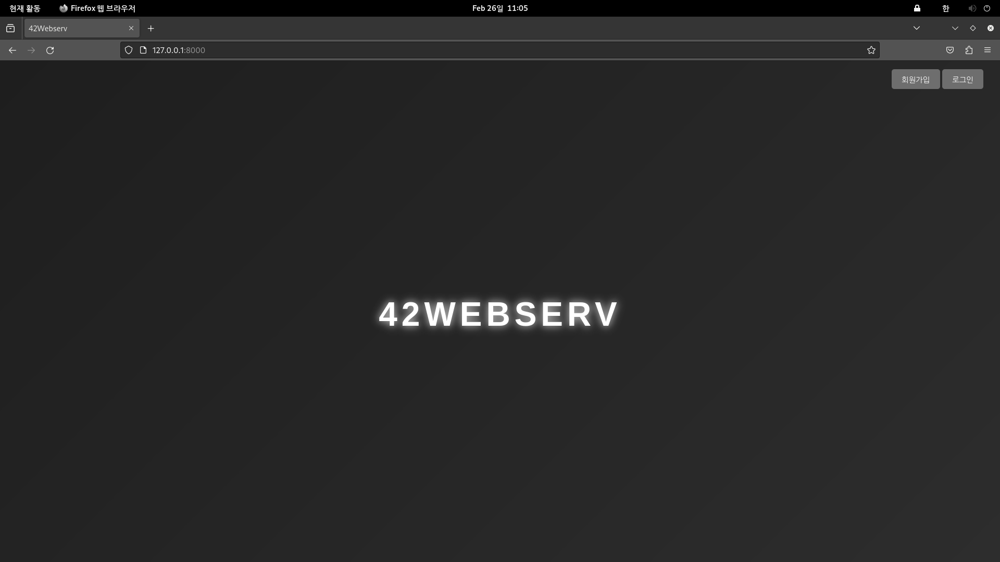
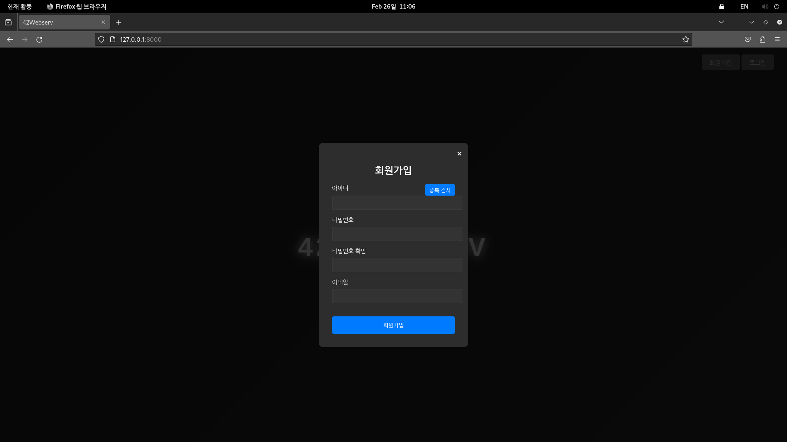
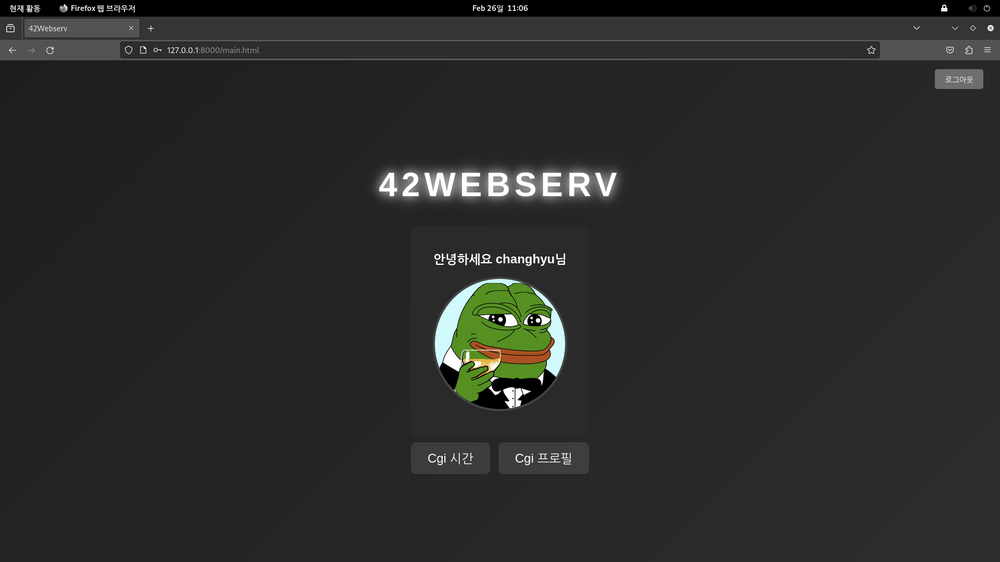
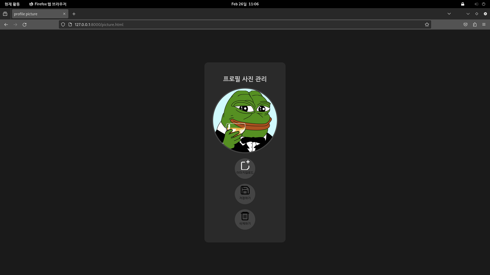
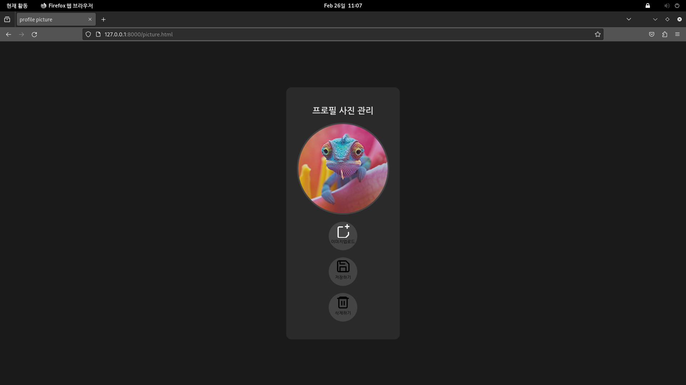
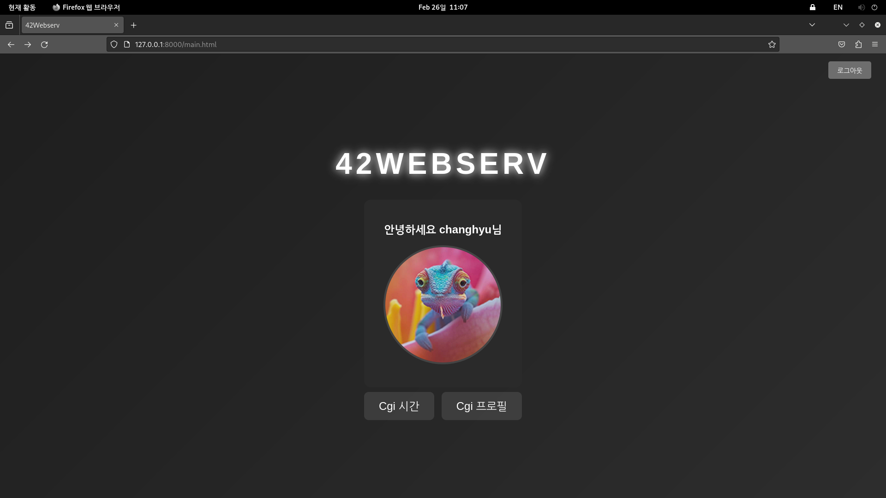
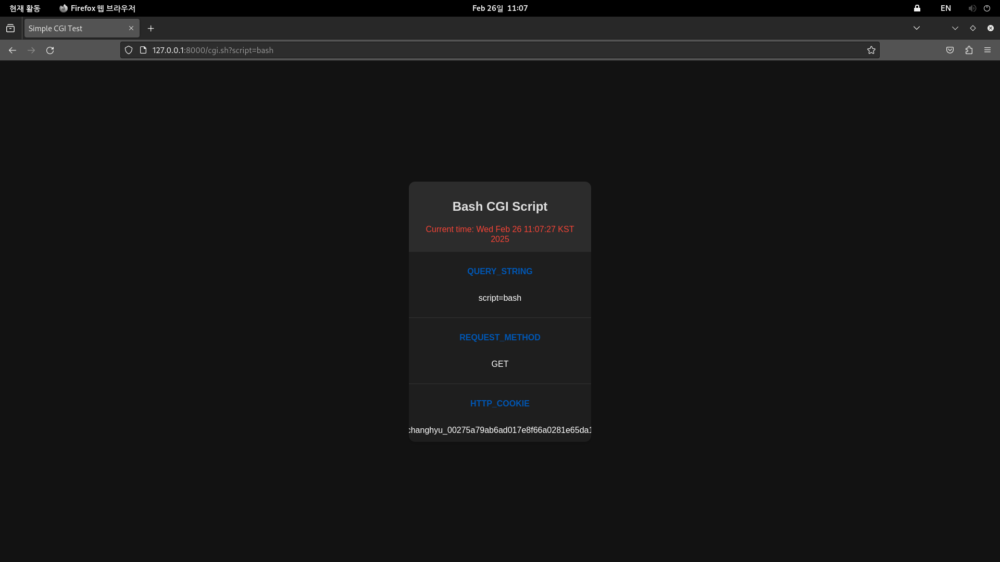

# 42_Webserv 🗓️ (24.10 - 24.12)

## 프로젝트 개요

이 프로젝트는 HTTP 프로토콜의 동작 방식과 클라이언트-서버 간 통신 과정을 깊이 있게 이해하고, 실제 웹 서버를 직접 구현하여 네트워크 프로그래밍 능력을 향상시키는 것을 목표로 진행되었습니다.

C++ 언어와 Epoll 기반의 I/O 멀티플렉싱 기술을 활용하여 고성능 웹 서버를 구현하고, HTTP 요청을 직접 파싱하여 응답을 생성하는 과정을 경험했습니다.

저수준 소켓 통신 과정에서 발생하는 다양한 문제점들을 해결하고, 멀티스레딩 환경에서의 동기화 문제를 해결하기 위해 노력했습니다. 본 프로젝트를 통해 HTTP 프로토콜, TCP/IP 소켓 통신, Epoll 기반의 I/O 멀티플렉싱, 그리고 멀티스레딩 프로그래밍에 대한 깊이 있는 이해를 얻을 수 있었습니다.

팀원

* CHyuni (C++, Epoll, HTTP Parsing)
* 1107c (C++, Epoll, HTTP Parsing)

## 기술 스택 (Technical Stack)

* C++: 주 개발 언어, 객체 지향 프로그래밍, 메모리 관리
* Epoll: I/O 멀티플렉싱, 높은 동시성 처리
* HTTP Parsing: HTTP 요청 파싱, 헤더 분석, 메시지 처리
* HTTP: 웹 서버 프로토콜

## 프로젝트 내용
C++ 언어와 Epoll 기반의 I/O 멀티플렉싱 기술을 이용하여 저수준 소켓 통신 과정 및 HTTP 프로토콜 등을 직접 이해하기 위한 프로젝트
Ngnix의 conf 파일과 같이 작성 된 Server.conf 파일을 파싱하여 서버의 IP, Port, location등을 해석 해 서버에 할당

Epoll 기반의 비동기 소켓 통신을 통해 고성능 정적 파일 서빙 기능을 구현했습니다. Epoll을 사용하여 다수의 클라이언트 요청을 효율적으로 처리하고, non-blocking I/O를 통해 응답 시간을 최소화했습니다. HTTP/1.1 프로토콜을 준수하며, keep-alive 연결을 지원하여 클라이언트와의 연결을 유지하고 재사용합니다.

외부 라이브러리 및 데이터베이스 없이 JSON 파일을 사용하여 회원 정보를 관리합니다. 회원 가입, 로그인, 중복 검사 등의 기능은 CGI 스크립트(Python)를 통해 구현했습니다. 보안 강화를 위해, 회원 가입 시 각 사용자에게 고유한 Salt 값을 생성하고, 패스워드를 해시화하여 저장합니다. Salt 값을 해시된 비밀번호에 추가하여 레인보우 테이블 공격에 대한 보안성을 높였습니다. JSON 파일 파싱 및 데이터 검증은 직접 구현했습니다.

로그인 성공 시, 사용자에게 기본 프로필 이미지를 표시하고, 이미지 업로드, 현재 시간 확인 (CGI), 로그아웃 기능을 제공합니다. 사용자 인증은 세션 기반으로 구현되었으며, 로그인 시 생성된 세션 ID는 쿠키를 통해 관리됩니다.

프로필 사진 업데이트 기능은 multipart/form-data 형식의 HTTP 요청을 통해 구현되었습니다. 클라이언트는 이미지를 선택하고, 서버는 전송된 데이터를 바운더리를 기준으로 파싱하여 파일 데이터를 추출합니다. 추출된 이미지 파일은 파일 확장자 및 크기 제한 등의 유효성 검사를 거친 후, 사용자 ID를 기반으로 생성된 디렉토리에 저장됩니다. 업로드 성공 시, 사용자 프로필 정보를 업데이트하고, 업데이트된 이미지를 화면에 표시합니다. 사용자는 저장 또는 삭제 버튼을 통해 프로필 이미지 변경을 확정하거나, 기본 이미지로 복원할 수 있습니다.

현재 시간 확인 기능은 CGI (Common Gateway Interface)를 통해 구현되었습니다. 클라이언트는 HTTP GET 요청을 통해 CGI 스크립트를 실행하고, 서버는 스크립트 실행 결과를 HTTP 응답으로 반환합니다. CGI 스크립트는 현재 시간을 HTML 형식으로 출력합니다. 
* **Query String:** CGI 스크립트 실행 시 전달되는 파라미터를 확인할 수 있습니다.
* **Request Method:** HTTP 요청 메소드 (GET, POST 등)를 표시합니다.
* **HTTP_COOKIE:** 클라이언트의 세션 ID를 확인할 수 있습니다. 세션 ID를 통해 사용자 인증 및 권한 관리를 수행합니다.

## 결론

본 프로젝트를 통해 C++ 언어를 사용하여 저수준 소켓 통신부터 HTTP 프로토콜 구현, 그리고 웹 서버의 핵심 기능들을 직접 개발하는 과정을 경험하며 **네트워크 프로그래밍에 대한 깊이 있는 이해**를 얻을 수 있었습니다. Epoll 기반의 I/O 멀티플렉싱을 통해 **높은 동시성을 확보**하고, HTTP 요청을 직접 파싱하여 응답을 생성하는 과정을 통해 **웹 서버의 동작 원리를 명확하게 이해**할 수 있었습니다. 특히, 데이터베이스 없이 JSON 파일 기반으로 회원 정보를 관리하고, CGI를 통해 동적인 콘텐츠를 생성하는 과정에서 **시스템 아키텍처 설계 능력**을 향상시킬 수 있었습니다.

**다만, 본 프로젝트는 학습 목적으로 개발되었기 때문에, 상용 웹 서버에 비해 기능, 성능, 보안 등 여러 면에서 부족한 점이 있습니다. 향후에는 WebSocket을 구현하여 실시간 통신 기능을 추가하고, HTTPS를 지원하여 보안성을 강화하며, 데이터베이스 연동을 통해 데이터 관리 효율성을 높일 계획입니다.**