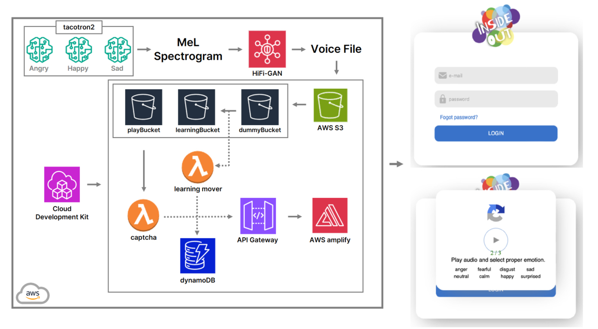
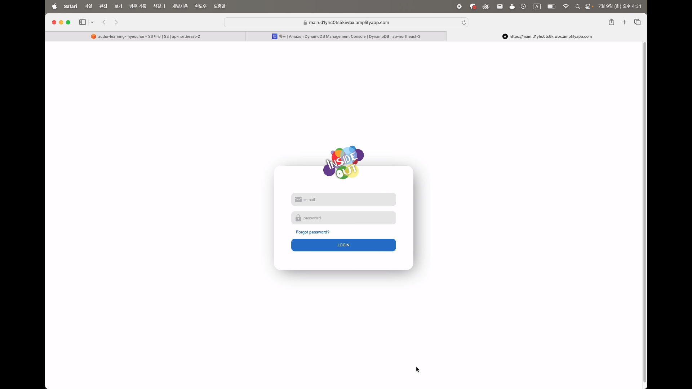
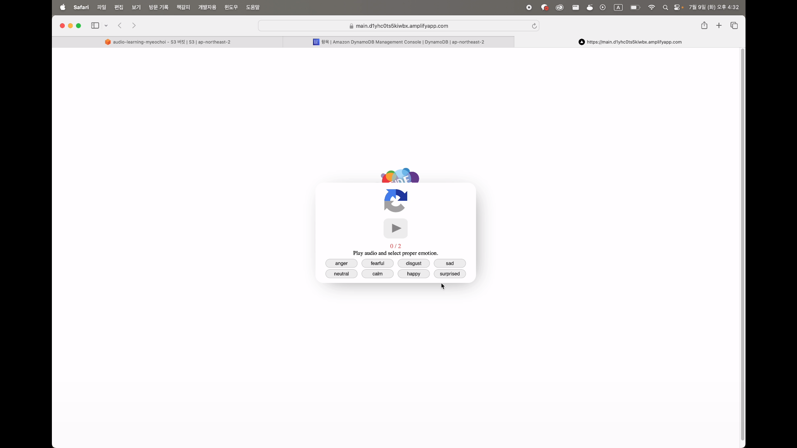
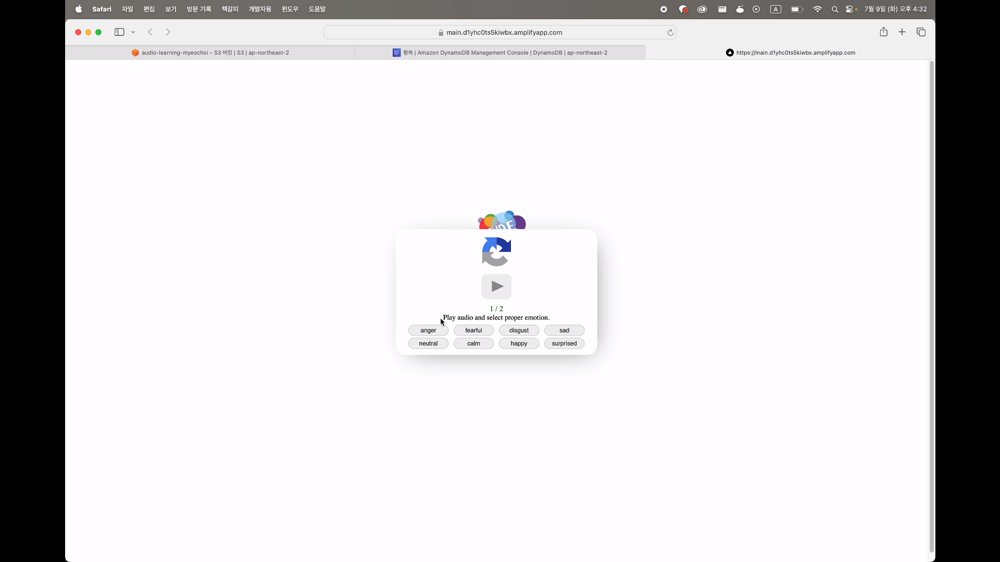
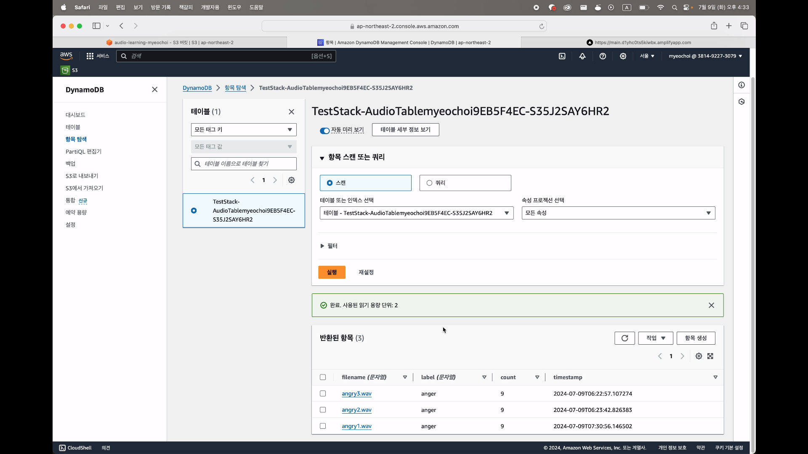
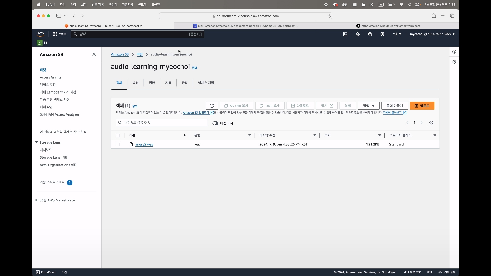

# InsideOut 🗓️ (24.07)

## 프로젝트 개요

본 프로젝트는 기존 텍스트 및 이미지 기반 CAPTCHA 시스템의 낮은 방어율을 개선하기 위해, **음성 기반 CAPTCHA 시스템**을 개발했습니다. 사용자는 감정이 담긴 음성 데이터를 듣고, 해당 감정을 올바르게 선택해야 CAPTCHA를 통과할 수 있습니다.

단순히 AI 모델을 적용하는 것을 넘어, AWS 클라우드 시스템을 활용하여 서버의 물리적 보안 및 클라우드 인프라 보안을 강화하고, IaC(Infrastructure as Code)를 구현하여 인프라 구축 및 배포 자동화를 경험하는 것을 목표로 했습니다. 이를 통해 시스템의 안정성과 확장성을 높이고, 운영 효율성을 개선했습니다.

[Repositories](https://github.com/CHyuni/insideoutCdk)

팀원

* CHyuni (AWS CDK, AWS Amplify, AWS Lambda, API Gateway)
* 1107c (AWS CDK, AWS Lambda, AWS DynamoDB, API Gateway)
* 최성현 (AI모델 파인튜닝)

## 기술 스택

* AWS CDK (Cloud Development Kit): Python을 사용하여 AWS 인프라를 코드로 정의하고 프로비저닝하는 데 사용했습니다. IaC (Infrastructure as Code)를 구현하여 인프라 관리 자동화를 구축했습니다.
* AWS S3 (Simple Storage Service): 오디오 파일 및 기타 정적 파일을 저장하기 위해 사용했습니다.
* AWS DynamoDB: 오디오 파일 정보 (파일명, 라벨 등)를 저장하기 위한 NoSQL 데이터베이스로 사용했습니다.
* AWS Lambda: 서버리스 함수를 실행하기 위해 사용했습니다. CAPTCHA 처리, 더미 데이터 생성, 데이터베이스 업데이트, 학습 데이터 이동 등의 백엔드 로직을 구현했습니다.
* AWS API Gateway: Lambda 함수를 호출하기 위한 REST API 엔드포인트를 생성하고 관리하는 데 사용했습니다.
* AWS Amplify: 웹 애플리케이션을 호스팅하고 배포하는 데 사용했습니다. GitHub 저장소와 연동하여 **자동 배포 파이프라인 (Continuous Delivery)을 구축했습니다. 현재는 Main 브랜치에 푸시될 때마다 자동으로 배포되도록 설정되어 있으며, 향후 CI (Continuous Integration) 단계를 추가하여 코드 품질 검사 및 테스트 자동화를 구현할 계획입니다.**
* Python: AWS CDK 코드 및 Lambda 함수를 작성하는 데 사용했습니다.

## 프로젝트 내용

본 프로젝트는 기존 텍스트 및 이미지 기반 CAPTCHA 시스템의 낮은 방어율을 개선하기 위해, **AI 기반 음성 CAPTCHA 시스템**을 개발했습니다. 사용자는 감정이 담긴 음성 데이터를 듣고, 해당 감정을 올바르게 선택해야 CAPTCHA를 통과할 수 있습니다.

*   **음성 데이터 활용:** 감정이 담긴 음성 데이터를 활용하여 CAPTCHA의 난이도를 높이고, 사용자에게 더욱 자연스러운 경험을 제공하고자 했습니다.
*   **TTS (Text-to-Speech) 모델 파인튜닝:** 봇이 쉽게 해독할 수 없는 다양한 음성 데이터를 생성하기 위해, TTS 모델을 특정 감정에 맞춰 파인튜닝했습니다.
*   **더미 데이터 활용:** AI 모델 학습을 위한 충분한 양의 데이터를 확보하기 위해, 긍정, 부정, 중립 등 다양한 감정을 표현하는 더미 데이터를 생성하고 활용했습니다.
*   **데이터 라벨링 및 검증:** 생성된 음성 데이터는 **수동으로 라벨링**하여 각 음성 파일에 감정 정보를 부여했습니다. 사용자가 선택한 감정과 **미리 라벨링된 정답 감정을 비교**하여 CAPTCHA 통과 여부를 결정합니다.

1.  **감정 음성 생성 파이프라인:**
    *   파인튜닝 된 Tacotron2 모델을 활용하여 다양한 감정(행복, 슬픔, 분노 등)이 담긴 음성을 생성합니다.
    *   생성된 음성은 MeL Spectrogram으로 변환됩니다.
    *   HiFi-GAN을 통해 고품질 음성 파일로 변환됩니다.
    *   최종 음성 파일은 AWS S3에 저장됩니다.
2.  **데이터 관리 시스템:**
    *   **dummyBucket (S3):** 라벨링이 필요한 검증용 음성 파일 저장
    *   **learningBucket (S3):** 검증 완료되어 학습에 사용될 음성 파일 저장
    *   **playBucket (S3):** CAPTCHA 실제 인증에 사용되는 음성 파일 저장
    *   Lambda 기반의 'learning mover' 함수가 일정 조건을 만족한 데이터를 dummyBucket에서 learningBucket으로 자동 이동시킵니다.
3.  **인프라 구축 및 관리:**
    *   AWS Cloud Development Kit(CDK)를 사용하여 전체 인프라를 코드로 관리합니다.
    *   DynamoDB에 오디오 파일 메타데이터 및 사용자 응답 데이터를 저장합니다.
4.  **사용자 인터페이스 및 인증 흐름:**
    *   AWS Amplify를 통해 웹 애플리케이션을 호스팅합니다.
    *   사용자가 로그인을 시도하면 CAPTCHA 인증 화면이 표시됩니다.
    *   재생 버튼을 통해 음성을 듣고 8가지 감정(화남, 두려움, 혐오, 슬픔, 중립, 차분함, 행복, 놀람) 중 적절한 감정을 선택합니다.
    *   API Gateway를 통해 Lambda 함수와 통신하여 사용자 선택을 검증합니다.

웹 페이지에 접속하면 먼저 홈 화면이 표시됩니다.

로그인을 시도하면 음성 CAPTCHA가 나타납니다. 사용자는 재생 버튼을 눌러 감정이 담긴 음성 텍스트를 듣고, 해당 감정을 8가지 보기 중에서 선택해야 합니다. 오답을 선택할 경우, 총 3번의 기회가 주어지며, 3번 모두 실패할 경우 봇으로 판단합니다.

2번째 문제에서는 **검증 데이터**를 사용하여 난이도를 높입니다. 사용자는 해당 음성이 어떤 감정을 담고 있는지 라벨링하도록 유도됩니다. 

**검증 데이터 DB (DynamoDB)**에는 각 음성 파일이 특정 감정으로 라벨링된 횟수가 저장됩니다. 

하나의 음성 파일에 대해 특정 감정 라벨의 수가 다른 감정 라벨 수보다 현저히 높을 경우 (예: 10회 이상), 해당 음성 파일은 해당 감정으로 라벨링된 것으로 판단하고, **학습 예정 데이터 DB**로 이동됩니다. 학습 예정 DB에 일정량의 데이터가 쌓이면, TTS 모델 파인튜닝을 진행하고, 해당 데이터는 삭제됩니다. 이를 통해 사용자의 참여를 통해 데이터를 수집하고, CAPTCHA 시스템의 정확도를 높일 수 있습니다.

## 결론

본 프로젝트는 기존 CAPTCHA 시스템의 한계를 극복하고자 음성 기반 CAPTCHA 시스템을 개발하고 AWS 클라우드 환경에 구축하는 과정을 성공적으로 수행했습니다. AI 모델 파인튜닝, IaC 기반 인프라 구축, 자동 배포 파이프라인 구현 등 다양한 기술적 도전을 통해 이론적인 지식을 실제 서비스에 적용하는 경험을 얻었습니다.

특히, 다음 사항들을 통해 프로젝트의 가치를 더욱 높일 수 있었습니다.
AI 모델 활용 및 AWS 클라우드 서비스 연동: TTS 모델 파인튜닝을 통해 생성된 음성 데이터를 AWS S3 버킷에 저장하고, Lambda 함수와 API Gateway를 통해 CAPTCHA 인증 로직을 구현함으로써, AI 모델의 결과물을 클라우드 서비스와 연동하여 활용했습니다.

사용자 참여형 데이터 수집 시스템 구축: CAPTCHA를 통해 수집된 사용자 라벨링 데이터를 활용하여 AI 모델을 지속적으로 개선하는 선순환 구조를 구축했습니다. 이는 CAPTCHA 시스템의 정확도를 높이고, 장기적인 유지보수 및 확장에 기여할 것입니다.

IaC 기반 인프라 구축 및 자동 배포 파이프라인 구현: AWS CDK를 사용하여 인프라를 코드로 관리하고, AWS Amplify를 통해 **자동 배포 파이프라인 (Continuous Delivery)**을 구축함으로써, 인프라 관리 효율성을 높이고, 배포 프로세스를 자동화했습니다.

이번 프로젝트를 통해 얻은 경험과 기술적 노하우는 앞으로 클라우드 기반 AI 서비스 개발 및 운영에 있어 큰 자산이 될 것입니다. 향후 CI/CD 파이프라인 구축, 보안 강화, 사용자 인터페이스 개선, 악성 봇 방지를 위한 음성 데이터에 미세한 변조와 같은 퍼즐 추가 등 지속적인 개선을 통해 시스템 완성도를 높여나갈 계획입니다.