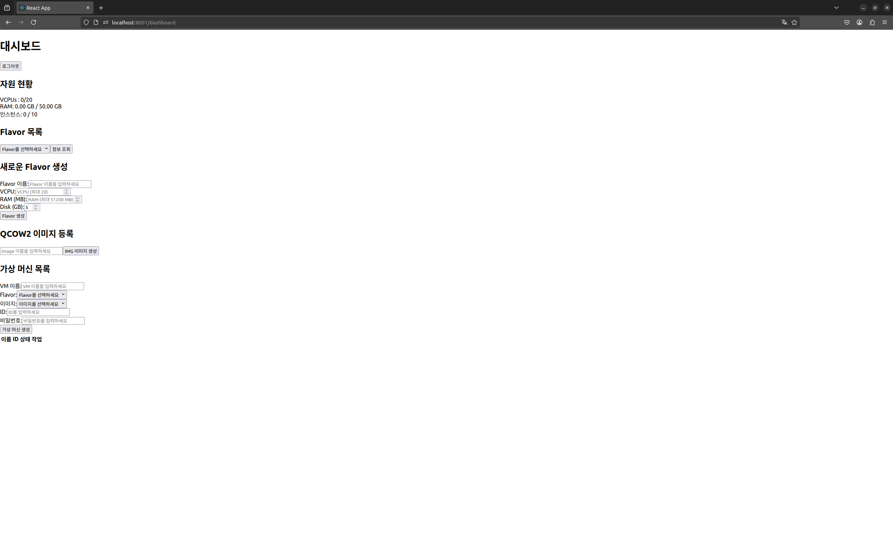
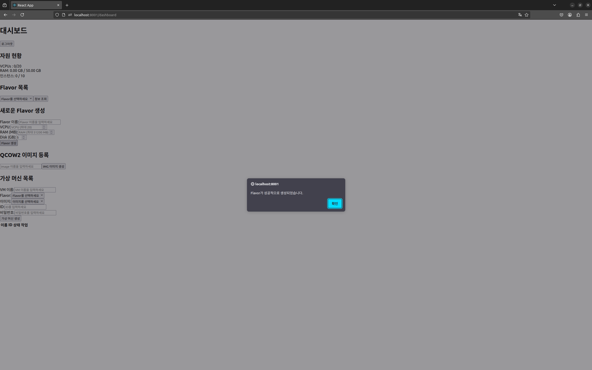
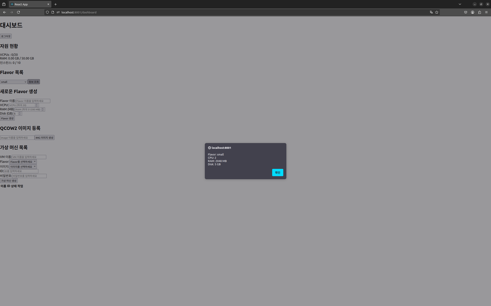
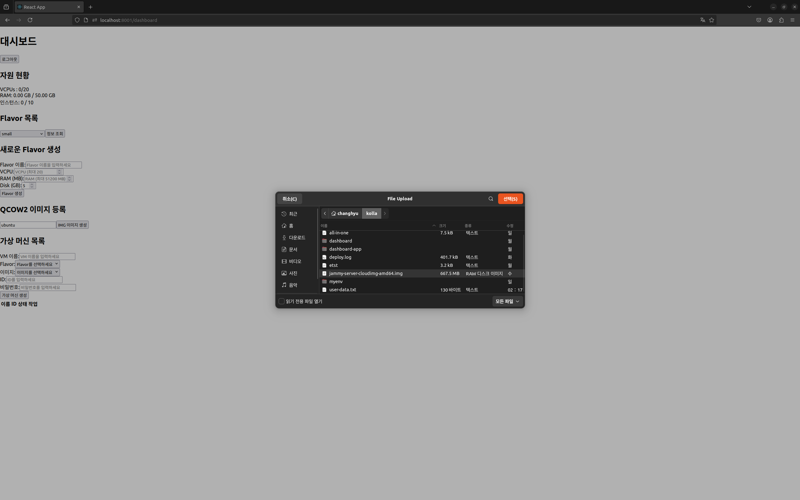
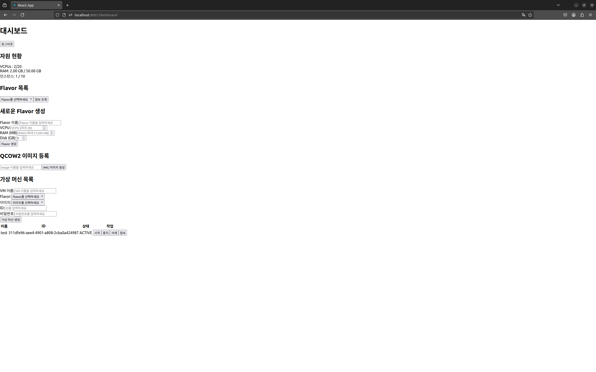
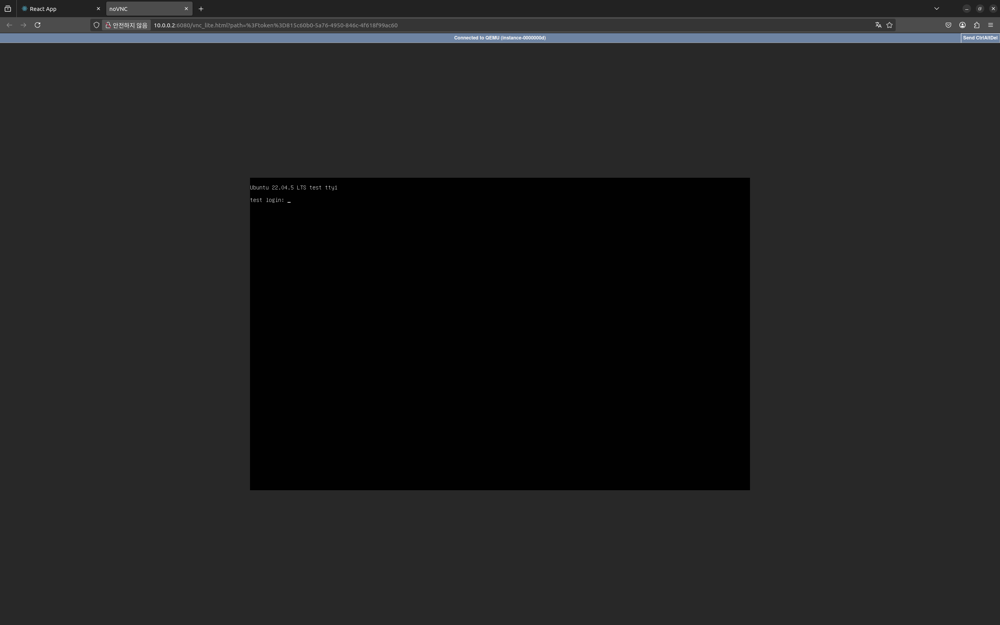
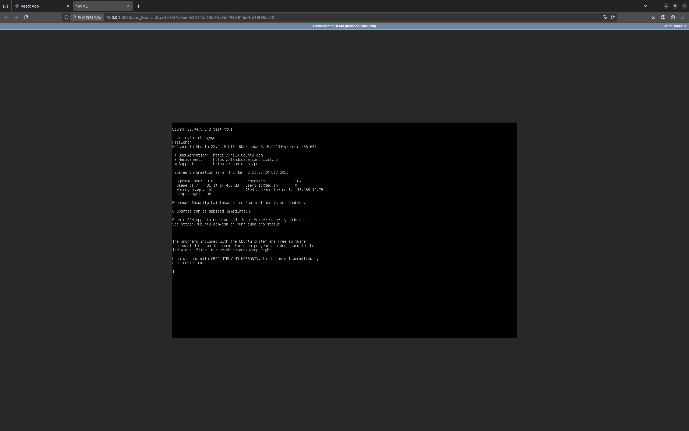
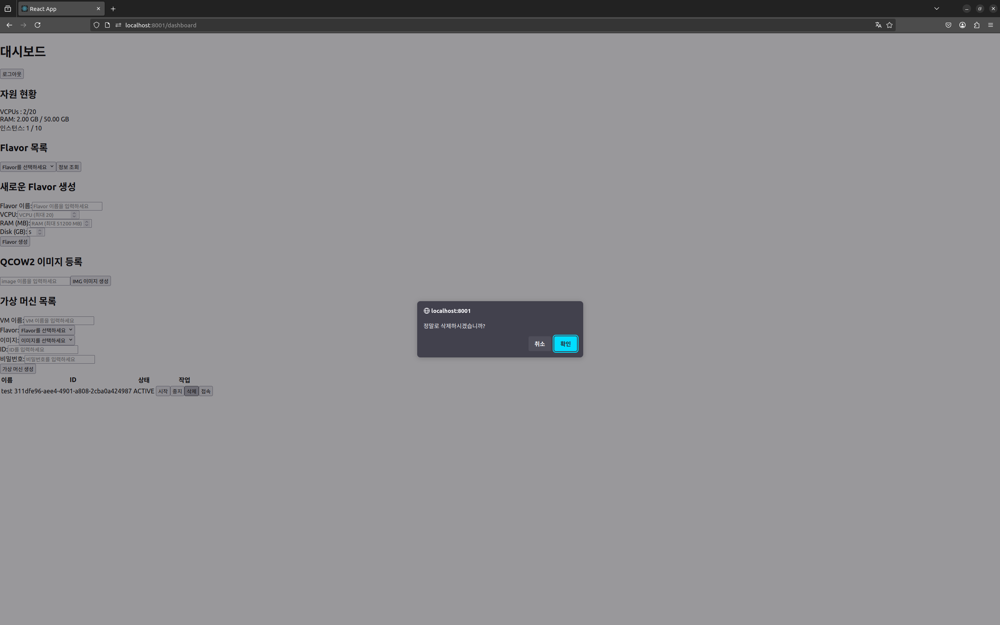
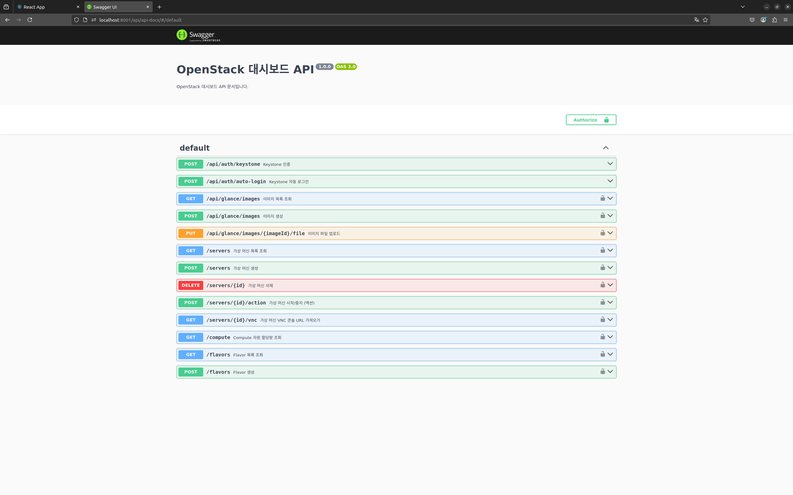
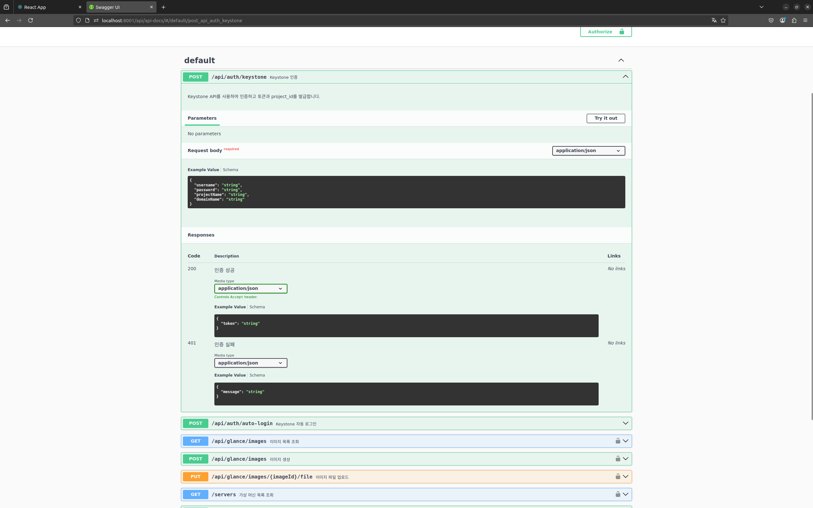

# OpenStack Horizon 대시보드 Node.js 이식 프로젝트 (25.03.02 - 25.03.07)

## 프로젝트 개요

본 프로젝트는 OpenStack Horizon 대시보드의 확장성 및 유지보수성 개선을 목표로, 핵심 기능들을 Node.js 기반으로 재구현하는 것을 목표로 합니다. 기존 Horizon 대시보드의 한계를 극복하고, 클라우드 환경에 대한 이해도를 높이며, 새로운 기술 스택을 활용한 대시보드 개발 가능성을 탐색하고자 했습니다.

[Repositories](https://github.com/CHyuni/openstack_dashboard)

팀원 (개인 프로젝트)

* CHyuni (Node.js 기반 API 개발, React 기반 UI 개발, OpenStack API 연동)

## 기술 스택

*   **Node.js:** 백엔드 API 및 로직 구현에 사용되었습니다. OpenStack API와 연동하여 핵심 기능들을 처리하고, 확장 가능한 아키텍처를 구축했습니다.
*   **React:** 사용자 인터페이스(UI) 개발에 사용되었습니다. 컴포넌트 기반 아키텍처를 통해 재사용성을 높이고, 향후 디자인 및 기능 확장을 용이하게 했습니다.
*   **OpenStack API:** Nova, Glance 등의 OpenStack API를 사용하여 가상 머신 및 이미지 관련 기능을 구현했습니다.
*   **Kolla-ansible:** OpenStack 환경 배포 및 관리에 사용되었습니다.

## 프로젝트 내용

본 프로젝트는 OpenStack Horizon 대시보드의 핵심 기능들을 Node.js 기반으로 재구현하여, 기존 대시보드의 한계를 극복하고 클라우드 환경에 대한 이해도를 높이는 것을 목표로 했습니다.

*   **Horizon 기능 이식:** Horizon 대시보드의 주요 기능들을 Node.js 환경으로 이식하여 기존 기능을 재구현하고, 새로운 기능 추가를 위한 기반을 마련했습니다.
*   **RESTful API 개발:** OpenStack API와 연동하여 가상 머신 및 이미지 관리 기능을 제공하는 RESTful API를 개발했습니다.
*   **UI 컴포넌트 개발:** React를 사용하여 재사용 가능한 UI 컴포넌트를 개발하고, 사용자 친화적인 인터페이스를 구축했습니다.

**구현 완료된 주요 기능:**

*   **Flavor 목록 조회:** OpenStack에 등록된 Flavor 정보를 조회합니다.
*   **Flavor 생성:** VCPU, RAM, Disk 용량 및 Flavor 이름을 입력하여 새로운 Flavor를 생성합니다.
*   **QCOW2 이미지 등록:** QCOW2 형식의 이미지를 OpenStack Glance에 등록합니다.
*   **가상 머신 생성:** 이름, Flavor, 이미지, ID 및 비밀번호를 입력하여 새로운 가상 머신을 생성합니다.

로그인 성공 시 접근 가능한 대시보드 화면입니다. 현재 UI는 기능 개발에 중점을 두어 기본적인 형태로 구현되었습니다. 향후 사용자 경험 개선을 위해 디자인 및 스타일을 개선할 예정입니다. 이 페이지에서 주요 기능들을 사용할 수 있습니다.

새로운 Flavor를 생성하는 화면입니다. Flavor 이름(Name), 가상 CPU(VCPU), 메모리(RAM), 디스크 용량(Disk)을 설정할 수 있습니다. 현재 디스크 용량은 개발 환경의 제약으로 인해 최대 5GB로 제한되어 있습니다.

생성된 Flavor 목록을 조회하고, 선택한 Flavor의 상세 정보를 확인할 수 있습니다. Flavor 이름(Name), 가상 CPU(VCPU), 메모리(RAM), 디스크 용량(Disk) 정보를 제공합니다.

Glance에 새로운 이미지를 등록하는 화면입니다. 이미지 이름(Name)을 설정하고, QCOW2 형식의 이미지 파일을 업로드할 수 있습니다. 향후 다양한 이미지 형식에 대한 지원을 추가할 계획입니다.

새로운 가상 머신을 생성하는 화면입니다. 가상 머신 이름(VM_Name), Flavor, 이미지(Image), ID, 비밀번호(PassWord)를 설정할 수 있습니다.

가상 머신 생성에 성공하면 가상 머신 목록에 새로운 가상 머신이 추가됩니다. 가상 머신 이름(Name), ID, 상태(Status) 정보를 확인할 수 있으며, 가상 머신을 시작(시작), 중지(중지), 삭제(삭제)하거나 VNC 콘솔에 접속(VNCConsole 접속)할 수 있습니다.

가상 머신 목록에서 '접속' 버튼을 클릭하면 해당 가상 머신의 VNC 콘솔 URL로 연결됩니다.

VNC 콘솔에 접속하여 가상 머신 생성 시 설정한 ID와 비밀번호를 사용하여 로그인할 수 있습니다.

VNC 콘솔을 통해 가상 머신에 접속하여 터미널을 사용하듯 명령어를 실행할 수 있습니다. (예시: `echo` 명령어)

가상 머신 목록에서 '삭제' 버튼을 클릭하면 가상 머신 삭제 여부를 확인하는 창이 나타납니다. '확인' 버튼을 누르면 해당 가상 머신이 삭제됩니다.

가상 머신 삭제가 완료되면 가상 머신 목록에서 해당 가상 머신이 삭제된 것을 확인할 수 있습니다.

Node.js를 사용하여 개발된 백엔드 API를 Swagger를 이용하여 문서화한 페이지입니다. API 엔드포인트, 요청 파라미터, 응답 구조 등을 확인할 수 있습니다.

Swagger 페이지에서 특정 API를 선택하면 해당 API의 상세 명세를 확인할 수 있습니다. API 사용법, 요청 예시, 응답 예시 등을 제공합니다.

## 결론

본 프로젝트를 통해 OpenStack Horizon 대시보드의 핵심 기능들을 Node.js 기반으로 재구현하면서 **클라우드 컴퓨팅 환경에 대한 깊이 있는 이해**를 얻을 수 있었습니다. 특히, OpenStack API (Nova, Glance 등)를 Node.js 환경에서 직접 연동하여 가상 머신 및 이미지를 관리하는 과정을 통해 **클라우드 인프라 제어 및 자동화 역량**을 향상시킬 수 있었습니다.

RESTful API를 설계하고, 백엔드 로직과 프론트엔드 인터페이스를 연동하는 과정을 통해 **시스템 통합 및 연동 능력**을 강화할 수 있었습니다. Swagger를 활용하여 API 문서화를 진행함으로써 **협업 및 유지보수성을 고려한 API 설계의 중요성**을 깨달았습니다.

**다만, 본 프로젝트는 OpenStack Horizon 대시보드의 일부 기능을 재구현하는 데 초점을 맞추었기 때문에, UI 디자인 및 사용자 경험 개선, API 기능 확장, 에러 처리 강화, 테스트 코드 작성 등 개선해야 할 부분이 남아있습니다. 향후에는 더 나은 사용자 인터페이스를 제공하고, 성능 최적화 및 보안 강화를 통해 실질적인 서비스 운영에 활용할 수 있도록 발전시켜나갈 계획입니다.**